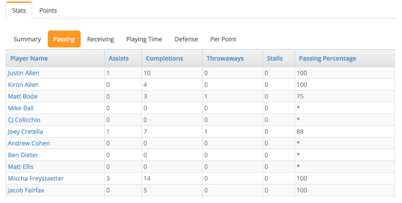

# Progress Report

## Overview

Our proposed application is a web-based platform that allows users to participate in “fantasy ultimate Frisbee.” Much like fantasy football, users will have the opportunity to “draft” different Frisbee players from teams around the country and compete against each other during the season. Metrics like goals, assists, blocks, and completion percentage will be used to score “points” each game between users. The user who scores a higher number of points than their opponent wins their game that week, and the user who wins the most games across the course of the season is the champion.

## Data Sources

The data used for this application will come from a website called UltiAnalytics ([www.ultianalytics.com](http://www.ultianalytics.com)), which serves as a repository for data from past ultimate Frisbee games. The website tracks data from every game from the American Ultimate Disc League (AUDL) website. To give a bit of background, the AUDL is the country’s only professional ultimate Frisbee league, and consists of 23 teams that compete across a 14-week regular season, and a 3-round playoff series. UltiAnalytics tracks AUDL game statistics on both per-player and per-game bases. As an example, here are some passing statistics for the Raleigh Flyers in their game against the Dallas Roughnecks in 2018:

For example, Mischa Freystaetter threw 3 assists and completed 100% of his passes, while Joey Cretella threw 1 assist and completed 88% of his passes, including one throwaway (or turnover). The Stats bar can be toggled to Receiving statistics as well:

Here, we can see that Justin Allen scored 2 goals in the game, and Joey Cretella had one drop.

All of the data we plan on using can be scraped easily from the UltiAnalytics website. The data is all summarized and tabulated in an easy-to-use fashion (as can be seen above), and thus, we don’t anticipate on encountering any major obstacles collecting it.

One important assumption about the data being modeled is that it is current, and gets updated each week. If the tables on the UltiAnalytics website weren’t updated weekly, it would be difficult for users to compete on a week-by-week basis. One way to get around this would be to run leagues based on previous years. For example, users could draft players from, say, the 2016 season, since all the data from that season is already available. Each week could be stepped through manually, rather than in real time, allowing users to complete fantasy leagues over whatever duration of time they choose. The big downside of this is that the game loses the thrill of competing against other users as a season unfolds in real time.

## Interface

The web interface will likely contain six pages to view: 1) weekly matchups and scores (summary), 2) individual page for each matchup, 3) league standings, 4) team rosters and statistics, 5) draft board (used at the start of the season), and trading page.

1.  The weekly summary matchup page will feature a list of matchups for the week and the scores of each game. For example, Week 7: User 1  57 - 48  User 2, User 3  68 - 61  User 4, etc. This page can be sorted by week (Weeks 1-14 across the season), or viewed all at once, by selecting (“View all weeks”) from a drop-down menu.
    
2.  The individual pages for matchups can be accessed by clicking the score of a matchup in the weekly summary page. For example, a user could click “57 - 48” on the summary page and would be taken to a page detailing how those two scores were calculated: which players on each team contributed, and what their stats were.
    
3.  The league standings table is very simple, simply consisting of the list of teams sorted by win-loss record. For example: User 1 4-0, User 2  3-1, User 3  1-3, etc.
    
4.  Each team roster is featured on its own page. For example, one could view User 1’s team by clicking their hyper-linked name somewhere on the website, which will redirect to the User 1 page. Here, one can view all of the players on their team, these players’ stats across the course of the season, and a list of that user’s previous and upcoming games.
    
5.  The draft board is used only at the beginning of the season when users select players. During the draft, every player, in the league is available for selection, with a “Select player” button next to them in the list. These players will be sorted in descending order by expected output, which can be calculated using the previous year’s statistics, in the same way that ESPN ranks football players during fantasy drafts, allowing users to see the best players first. A random number generator will determine the draft order, and from there, each user can select a player/team offense/team defense from the list. Users will likely be able to select approximately 7 players, though these numbers can be adjusted depending on the size of the league (the details of this will be determined later). When a user clicks a “Select” button, that player/team offense/team defense is added to their roster, and the next User in the draft order can pick. At the end of the draft, the page will be frozen so that users can view, but not modify, the information there.
    
6.  The final page for users is a designed for trading. At any point during the season, two users can trade players with one another, which is another common feature of fantasy football. A user would be able to select another user to trade with from the drop-down menu, then select which of their player(s) they’re interested in trading for the other user’s player(s). The other player would have to approve this trade (a notification would appear in their trade page), and if approved, the players would be swapped between the two rosters.

## Schema Design

## E/R Diagram

