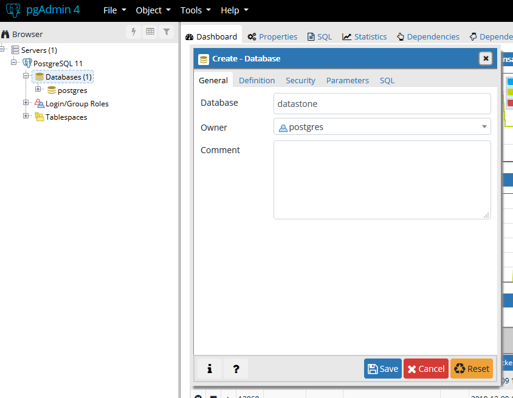
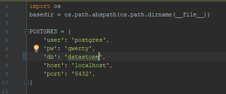

# Datastone: A Fantasy Ultimate Frisbee Simulator

Members: Remy Freire, Jeffrey He, Neil Luo, Junmo Ryang, Edward Zhuang 

## About Datastone
Datastone is a Flask/PostgreSQL-based web application which allows users to compete in fantasy Ultimate Frisbee leagues, and it incorporates players and statistics from the American Ultimate Disc League (AUDL). 

## Setting up Datastone

### Compiling/Deploying:
To compile and deploy Datastone, please follow these instructions:

1.  Clone the repository at https://github.com/edward638/datastone/.
2. Install PostgreSQL and pgAdmin 4. 
3. In pgAdmin, create a new database called datastone.

4. In your terminal, go to the appropriate directory and run the following commands to install the following libraries. 

```console
pip install flask
pip install flask-wtf
pip install psycopg2
pip install sqlalchemy
pip install flask-login
pip install flask-migrate
```
5. Ensure that the POSTGRES variable in config.py is set up correctly, and matches the properties of your PostgreSQL server.

6. Run the following commands to set up the tables in your database.
```console
flask db init
flask db migrate
flask db upgrade
```
7. In pgAdmin, go to your database, access the week table, and insert a row where week_number = 0.
8. Similarly, access the settings table and insert a row where active = 0.
9. Right click on the player_data on the navigation bar and import AUDL_2018.csv (found in db/data/fixeddata). Under "Miscellaneous", choose **Header = Yes and Delimiter = ","**. This will populate the player_data table.
10. Using the pgAdmin query tool, run this query (this can be found in db/begin.sql) to update the player_status table.
```sql
WITH IND(i) AS (SELECT * FROM generate_series(0, (SELECT COUNT(*) FROM player_data) - 1, 1))  
INSERT INTO player_status SELECT  
  i,  
  (SELECT name FROM player_data WHERE id = i),  
  (SELECT (12*goals_avg+12*assists_avg+24*blocks_avg+0.5*catches_avg+0.5*completions_avg-14*throwaways_avg-14*drops_avg+72*callahans_avg) FROM player_data WHERE id = i),  
  (SELECT (SQRT((12*goals_sd)^2+(12*assists_sd)^2+(24*blocks_sd)^2+(0.5*catches_sd)^2+(0.5*completions_sd)^2+(-14*throwaways_sd)^2+(-14*drops_sd)^2)+(72*callahans_sd)^2) FROM player_data WHERE id = i),  
  -1,  
  0  
FROM IND;
```
11. In your terminal, type in 
```console 
flask run
```
This will allow you to run the application on your localhost (127.0.0.1:5000). 
